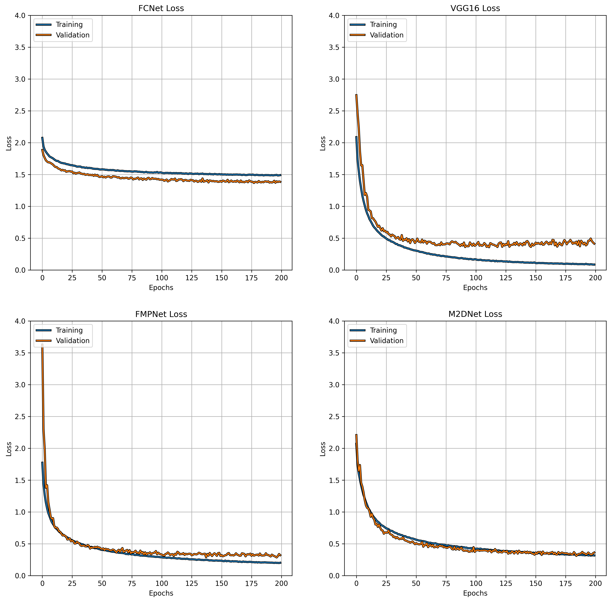
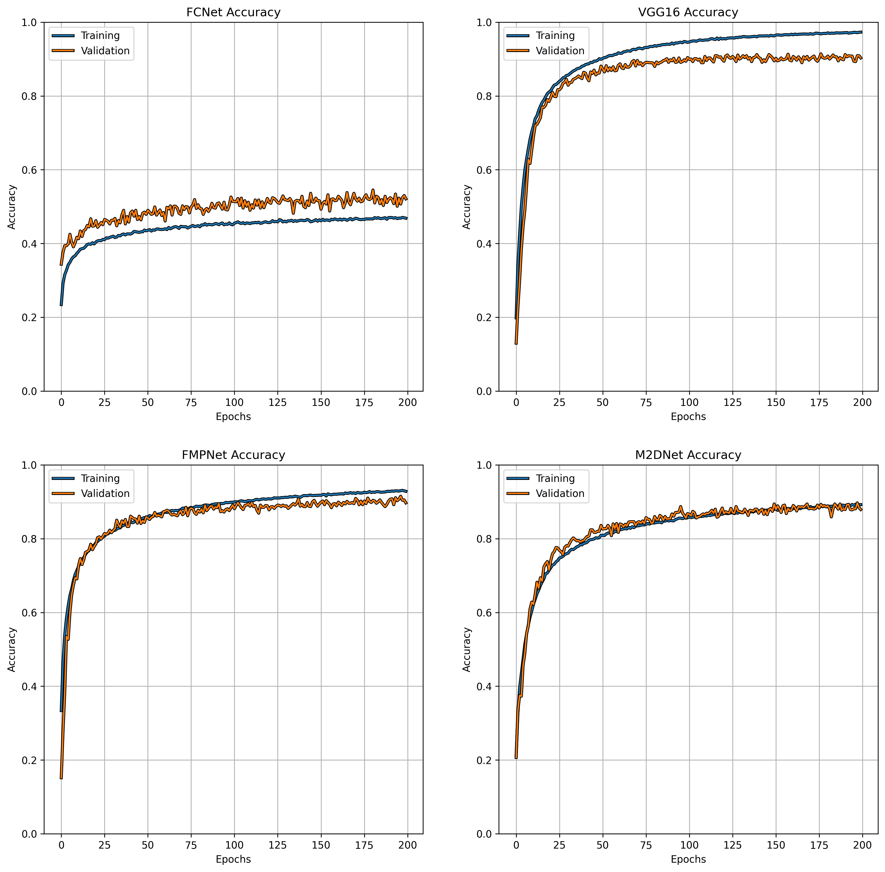

# Training With Fractional Max-Pooling

By Sudharshan Subramaniam Janakiraman et al. (2022)

## Motivation

Study Generalization potential of Deep Learning Systems on small scale and large scale datasets with different training and architectural conditions

## Overview

Deep Learning Systems have evolved so much in the recent times in solving a single task on a carefully constructed and trained dataset. For example. State of the Art Networks such as Vgg16, Resnet50 achive the best accuracy on imagenet, cifar10 classification etc., The Purpose of this project is to test these architectures in differnt training conditions with a single purpose - Generalization ability of the model to different datasets.

Training, testing, validation datasets will be constructed and evaluvated on a certain list of models (listed below) to measure the generalization potential.

The Architectures selected are as follows:
- Fully Connected Network (Baseline) - mostly not useful
- Vgg16 (Maxpooling2d) - Focus on generalization abaility | Maxxpooling is invariant to rotation
- Fractional Max pooling Network 
- maxpooling2d Network with similar parameters to FMP

## Main Results

``` Cifar10 Training and Validation Loss```


``` cifar10 Training and Validation Accuracy ```


## Discussion

...

## Detailed Reports


 1. [Fractional Max-Pooling Explanation](reports/frac_max_pooling_explanation.md) (Markdown Report).
 2. [Minimal Fractional Max-Pooling Demonstration](reports/min_frac_max_pooling_demo.ipynb) (Jupyter Notebook).
 3. [Baseline Experiment](reports/baseline_experiment.ipynb) (Jupyter Notebook).
 4. [Method 1: ???](reports/method1_experiment.ipynb) (Jupyter Notebook).
