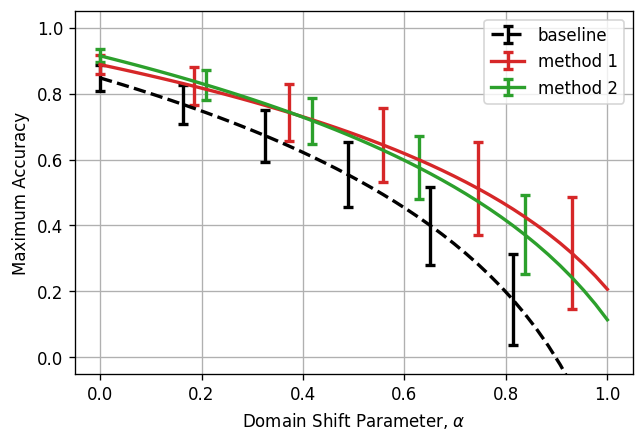

# Training With Fractional Max-Pooling

By Sudharshan Subramaniam Janakiraman et al. (2022)

## Motivation

...

## Overview

...

## Main Results

## Discussion

...

## Detailed Reports

 1. [Fractional Max-Pooling Explanation](reports/frac_max_pooling_explanation.md) (Markdown Report).
 2. [Minimal Fractional Max-Pooling Demonstration](reports/min_frac_max_pooling_demo.ipynb) (Jupyter Notebook).
 3. [Baseline Experiment](reports/baseline_experiment.ipynb) (Jupyter Notebook).
 4. [Method 1: ???](reports/method1_experiment.ipynb) (Jupyter Notebook).
